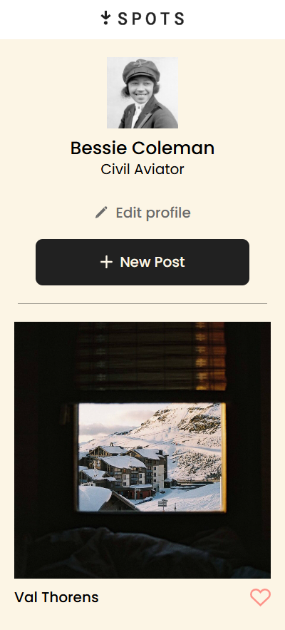
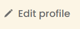
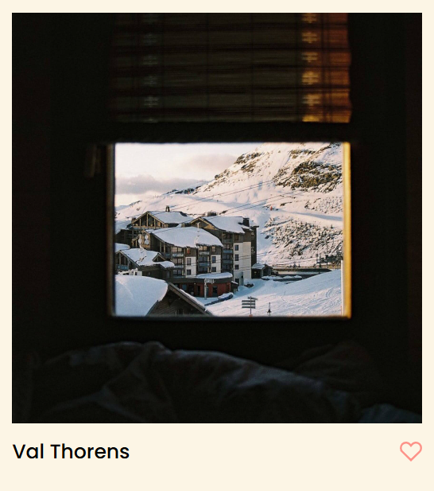

# Project 3: se_project_spots `English Version`

## A DESCRIPTION OF THE PROJECT AND ITS FUNCTIONALITY
In this project, I implemented most of the topics learned during Sprints 1 through 3, where I created a page following the data and specifications provided in the brief in Figma, keeping in mind that it would also need to undergo certain changes when the screen size changed to that of a mobile device.

## A DESCRIPTION OF THE TECHNOLOGIES AND TECHNIQUES USED
I also used tools like Dot, Toggle Chat, and those of my tutors, who helped me resolve my doubts and gave me ideas on how to implement certain properties that I had no idea what they were for and what effect they had on my code. The most notable, for example, was the like button, which turns red when I click it, among other functions, etc.

### - RESPONSIVE DESIGN

**In the `blocks/cards.css` file, the following property is used for the card layout:**

```css grid-template-columns: repeat(auto-fill, minmax(413px, 1fr));```

**WHAT DOES THIS LINE DO?**

- Use CSS Grid to create as many columns as fit in the container.
- Each column has a minimum width of 413px and can expand to fill the available space.
- This allows the number of columns to automatically adapt to the screen size, making the design responsive.
- If there is insufficient space for another 413px column, the existing columns expand to fill the container, avoiding empty spaces.

This technique ensures that cards look good on both large and small screens, maintaining a flexible and modern design.

**A new `@media screen` property has been implemented in the `cards.css` - `card.css` - `profile.css` files.**

**FUNCTION?**

The `@media screen and (max-width: 627px)` block is a CSS **media query**. It is used to apply styles only when the screen has a maximum width of 627 pixels (for example, on mobile or small screens).

In my code:

``` css
@media screen and (max-width: 627px) {
.cards__list{
grid-template-columns: repeat(auto-fit, 288px);
gap: 20px 12px;
}
}
```
*RESULT ↓*


**WHAT DOES THIS DO?**
- When the screen is 627px or smaller:
- `.cards__list` will display the cards in columns 288px wide.
- The space (`gap`) between cards will be 20px vertically and 12px horizontally.
- New properties were also implemented for each of the elements involved in this line of code, such as their `width, font-size, margin`, among others.

**WHAT IS IT FOR?**
- To make your design **responsive** and adapt well to mobile devices, displaying smaller cards with less space between them.

**As the last and most important feature I had in the code for this project, I dared to implement a JavaScript function to give more creativity to the like button and to change its color to red when the user clicked on it.**

The filter implemented in `.profile__edit-btn img`:

``` css
filter: invert(42%) sepia(0%) saturate(6%) hue-rotate(202deg) brightness(95%) contrast(92%);
```
*RESULT ↓*



**What's it for?**
This CSS filter transforms the icon's original color (usually black) to resemble the gray color `#6B6B6B`, just like the button's text.

**HOW DOES EACH PART WORK?**
- `invert(42%)`: Partially inverts the colors, lightening the black.
- `sepia(0%)`: Does not apply a sepia effect (the original color is maintained).
- `saturate(6%)`: Increases saturation, but since the color is gray, the effect is minimal.
- `hue-rotate(202deg)`: Changes the hue, but it's barely noticeable in grayscale.
- `brightness(95%)`: Darkens the image slightly.
- `contrast(92%)`: Reduces contrast, softening the color.

*Result ↓ *

**SUMMARY:**
This filter is a "trick" to make a black (or solid-color) icon appear gray, without having to edit the original image. This way, the icon visually matches the button text.

*To calculate these values, use the following tool*
- Online Tools [**CSS Filter Generator**](https://codepen.io/sosuke/pen/Pjoqqp)
- Enter the hex color (#6B6B6B)
- The tool automatically calculates the filter values

***[LINK TO MY DEPLOYED PROJECT ON GITHUB PAGE](https://cristian-h97.github.io/se_project_spots/)***


# Project 3: se_project_spots `Spanish Version`

## DESCRIPCIÓN DEL PROYECTO Y SU FUNCIONALIDAD
En este proyecto, implementé la mayoría de los temas aprendidos durante los Sprints 1 a 3, donde creé una página siguiendo los datos y las especificaciones del briefing en Figma, teniendo en cuenta que también tendría que sufrir ciertos cambios al cambiar el tamaño de la pantalla al de un dispositivo móvil.

## DESCRIPCIÓN DE LAS TECNOLOGÍAS Y TÉCNICAS UTILIZADAS
También utilicé herramientas como Dot, Toggle Chat y las de mis tutores, quienes me ayudaron a resolver mis dudas y me dieron ideas sobre cómo implementar ciertas propiedades que desconocía para qué servían y qué efecto tenían en mi código. La función más destacada, por ejemplo, fue el botón "Me gusta", que se vuelve rojo al hacer clic, entre otras funciones.

### - DISEÑO RESPONSIVO

**En el archivo `blocks/cards.css`, se utiliza la siguiente propiedad para el diseño de la tarjeta:**

```css grid-template-columns: repeat(auto-fill, minmax(413px, 1fr));```

**¿QUÉ HACE ESTA LÍNEA?**

- Usar CSS Grid para crear tantas columnas como quepan en el contenedor.
- Cada columna tiene un ancho mínimo de 413 px y se puede expandir para llenar el espacio disponible.
- Esto permite que el número de columnas se adapte automáticamente al tamaño de la pantalla, lo que hace que el diseño sea responsivo.
- Si no hay espacio suficiente para otra columna de 413 px, las columnas existentes se expanden para llenar el contenedor, evitando espacios vacíos.

Esta técnica garantiza que las tarjetas se vean bien tanto en pantallas grandes como pequeñas, manteniendo un diseño flexible y moderno.

**Se ha implementado la nueva propiedad `@media screen` en los archivos `cards.css` - `card.css` - `profile.css`.**

**¿FUNCIÓN?**

El bloque `@media screen and (max-width: 627px)` es una **consulta de medios** CSS. Se utiliza para aplicar estilos solo cuando la pantalla tiene un ancho máximo de 627 píxeles (por ejemplo, en dispositivos móviles o pantallas pequeñas).

En mi código:

``` css
@media screen and (max-width: 627px) {
.cards__list{
grid-template-columns: repeat(auto-fit, 288px);
gap: 20px 12px; }
}
```
*RESULTADO ↓*


**¿QUÉ HACE ESTO?**
- Cuando la pantalla tiene 627 px o menos:
- `.cards__list` mostrará las tarjetas en columnas de 288 px de ancho.
- El espacio (`gap`) entre tarjetas será de 20 px verticalmente y 12 px horizontalmente.
- También se implementaron nuevas propiedades para cada uno de los elementos involucrados en esta línea de código, como su `width`, `font-size`, `margin`, entre otras.

**¿PARA QUÉ SIRVE?**
- Para que tu diseño sea **responsive** y se adapte bien a dispositivos móviles, mostrando tarjetas más pequeñas con menos espacio entre ellas.

**Como última y más importante característica del código de este proyecto, me atreví a implementar una función de JavaScript para darle más creatividad al botón "Me gusta" y cambiar su color a rojo al hacer clic.**

El filtro implementado en `.profile__edit-btn img`:

``` css
filter: invert(42%) sepia(0%) saturate(6%) hue-rotate(202deg) brilliant(95%) contrast(92%);
```
*RESULT ↓*


**¿Para qué sirve?**
Este filtro CSS transforma el color original del icono (normalmente negro) para que se parezca al gris `#6B6B6B`, igual que el texto del botón.

**¿CÓMO FUNCIONA CADA FACTOR?**
- `invert(42%)`: Invierte parcialmente los colores, aclarando el negro. - `sepia(0%)`: No aplica efecto sepia (se conserva el color original).
- `saturate(6%)`: Aumenta la saturación, pero al ser gris, el efecto es mínimo.
- `hue-rotate(202deg)`: Cambia el tono, pero es prácticamente imperceptible en escala de grises.
- `brightness(95%)`: Oscurece ligeramente la imagen.
- `contrast(92%)`: Reduce el contraste, suavizando el color.

*Result ↓ *

**RESUMEN:**
Este filtro es un truco para que un icono negro (o de color sólido) parezca gris, sin tener que editar la imagen original. De esta forma, el icono se ve igual que el texto del botón.

*Para calcular estos valores, utiliza la siguiente herramienta*
- Herramientas en línea [**Generador de filtros CSS**](https://codepen.io/sosuke/pen/Pjoqqp)
- Introduce el color hexadecimal (#6B6B6B)
- La herramienta calcula automáticamente los valores del filtro

***[ENLACE A MI PROYECTO IMPLEMENTADO EN LA PÁGINA DE GITHUB](https://cristian-h97.github.io/se_project_spots/)***
